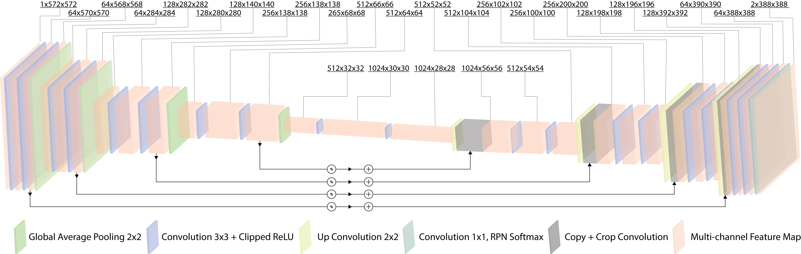

# RSSNet
A modified version of U-Net specifically fine-tuned for robotic surgical tool segmentation with Atrous Spatial Pyramid Pooling module.

**Instructions**
- Replace the images/mask path with the dataset parent folders.
- Resize images/mask to the same resolution (if required by your dataset).
- Requires GPU Encoder.

**Steps for Implementation: Detailed Guide**

**1.RSSNet.m:**
- Define the neural network layers, including ASPP, average pooling, and convolutional layers with multiscale kernels. Use MATLAB's Deep Learning Toolbox or custom layer definitions.

**2.DataLoader.m:**
- Implement functions to load dataset images and annotations, perform preprocessing (such as normalization or resizing), and create data augmentation techniques if needed.
- loadDataset: Loads images and corresponding masks/labels from a given dataset path. Update this function to suit your dataset's structure and file formats.
- preprocessData: Preprocesses the loaded images and masks. In this example, it resizes the images and masks to a fixed size. You can add other preprocessing steps like normalization, data augmentation, or custom transformations as required.

**3.TrainRSSNet.m:**
- Use DataLoader.m to load training data.
- Define training parameters (epochs, batch size, learning rate, etc.).
- Train the RSSNet model using MATLAB's built-in training functions or custom training loops. Save the trained model weights.
- Loading and Preprocessing: It uses the DataLoader class to load and preprocess the dataset, splitting it into training and validation sets.
- Model Configuration: Creates an instance of the RSSNet model using the RSSNet function.
- Training Options: Defines training options using trainingOptions from the Deep Learning Toolbox.
- Data Formatting: Converts the data into a suitable format (imageDatastore and pixelLabelDatastore) required for training with MATLAB's Deep Learning Toolbox.
- Training the Model: Initiates the training process using trainNetwork function, passing in training data, the model, and defined options.
- Saving the Model: Saves the trained model for later use.

**4.EvaluateRSSNet.m:**
- Load the trained model weights.
- Load validation or test datasets using DataLoader.m.
- Perform segmentation on these datasets using the trained RSSNet model.
- Compute evaluation metrics like Dice coefficient and mIoU.
- Load Trained Model: Loads the previously trained RSSNet model.
- Load and Preprocess Validation/Test Dataset: Uses the DataLoader class to load and preprocess the validation or test dataset.
- Format Data for Evaluation: Converts the preprocessed data into the format suitable for evaluation using imageDatastore and pixelLabelDatastore.
- Perform Segmentation: Utilizes the trained model to predict segmentation masks for the validation/test dataset using semanticseg.
- Calculate Evaluation Metrics: Evaluates the segmentation results using predefined ground truth masks and calculates metrics such as Dice coefficient, mIoU, etc., using evaluateSegmentation.
- Display or Save Results: Displays or saves the evaluation metrics for further analysis or reporting purposes.

**5.AblationStudy.m:**
- Modify the RSSNet architecture by removing or altering specific components (ASPP, average pooling, etc.) to analyze their impact on segmentation accuracy.
- Run experiments and record performance metrics for comparison.
- Loading the Trained Model: Loads the trained RSSNet model.
- Loading and Preprocessing Validation/Test Dataset: Loads and preprocesses the validation/test dataset using the DataLoader.
- Performing Segmentation and Evaluation: Segments the validation/test dataset using the full RSSNet model and calculates evaluation metrics.
- Conducting Ablation: Modifies the model by removing or altering specific components (in this example, removing ASPP) and evaluates the modified model's performance.
- Comparison and Display: Compares the evaluation metrics between the full model and the modified model to analyze the impact of the removed component.

After creating these files, organize them within a directory structure.
